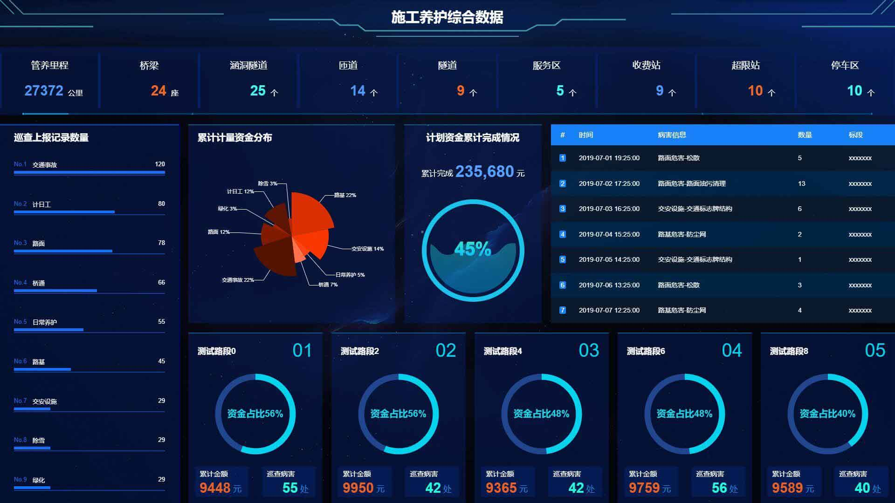

<h1 align="center">Datax</h1>
<p align="center">
    <a href="https://github.com/east-century-fex/DataX/blob/master/LICENSE">
      
    </a>
    <a href="https://www.npmjs.com/package/@east-century/data-view">
      
    </a>
</p>

## DataX是干什么的?

* DataX是一个基于**Vue**的数据可视化组件库
* 提供用于提升页面视觉效果的**SVG**边框和装饰
* 提供常用的**图表**如折线图等
* 飞线图/轮播表等其他组件

### npm安装

```shell
$ npm install @east-century/datax
```

### 使用

```js
import Vue from 'vue'
import DataX from '@east-century/datax'

Vue.use(DataX)

// 按需引入
import { borderBox1 } from '@east-century/datax'
Vue.use(borderBox1)
```

详细文档及示例请移步[HomePage](https://eastcenturyfe.github.io/datax-document-code).


### Demo

Demo页面使用了全屏组件，请F11全屏后查看。

* 施工养护综合数据



* 机电运维管理台


* 机电设备电子档案


